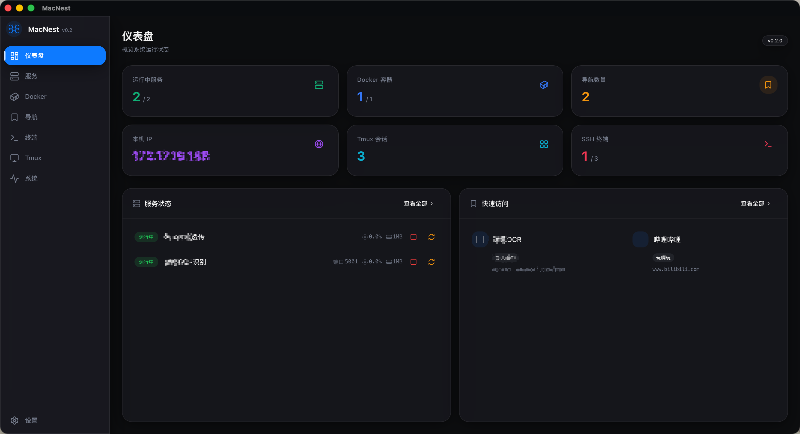
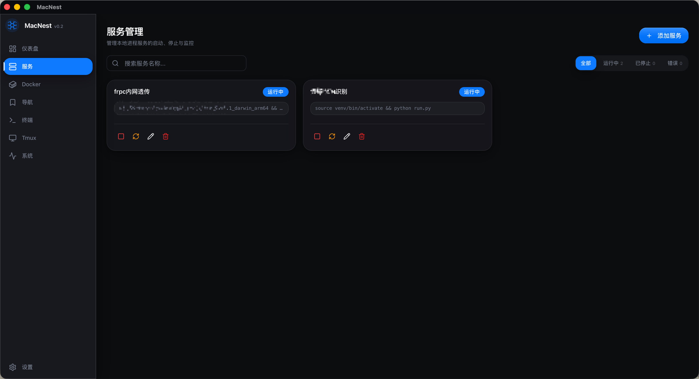
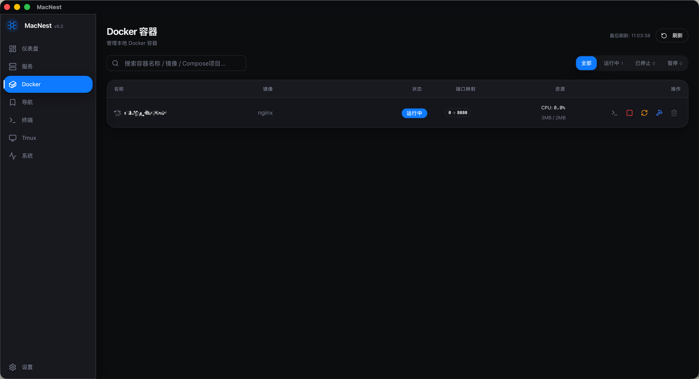
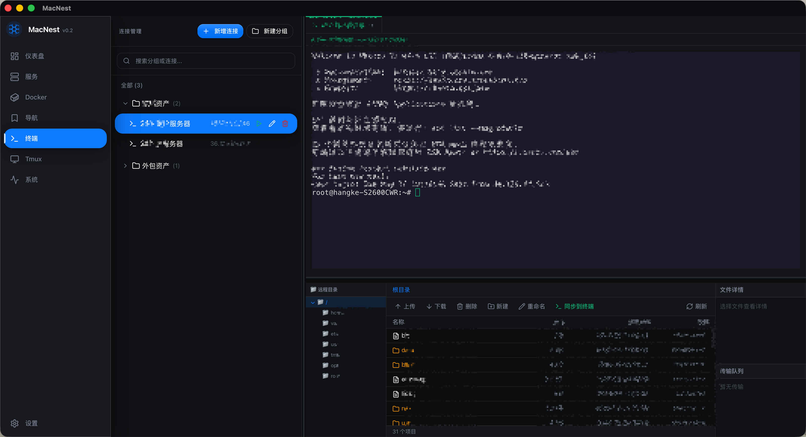
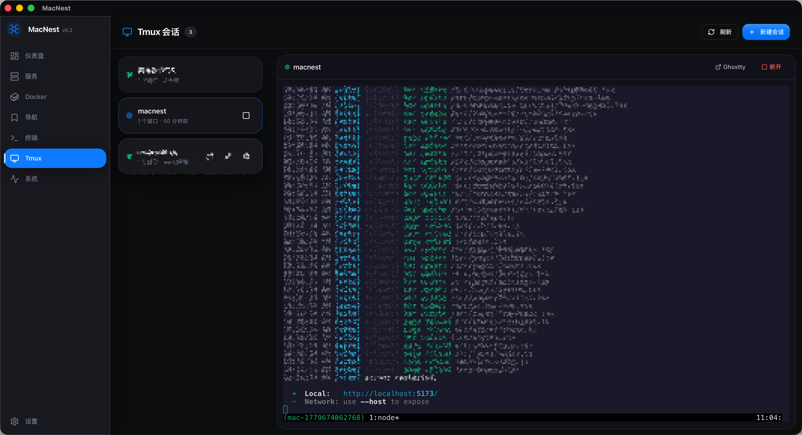
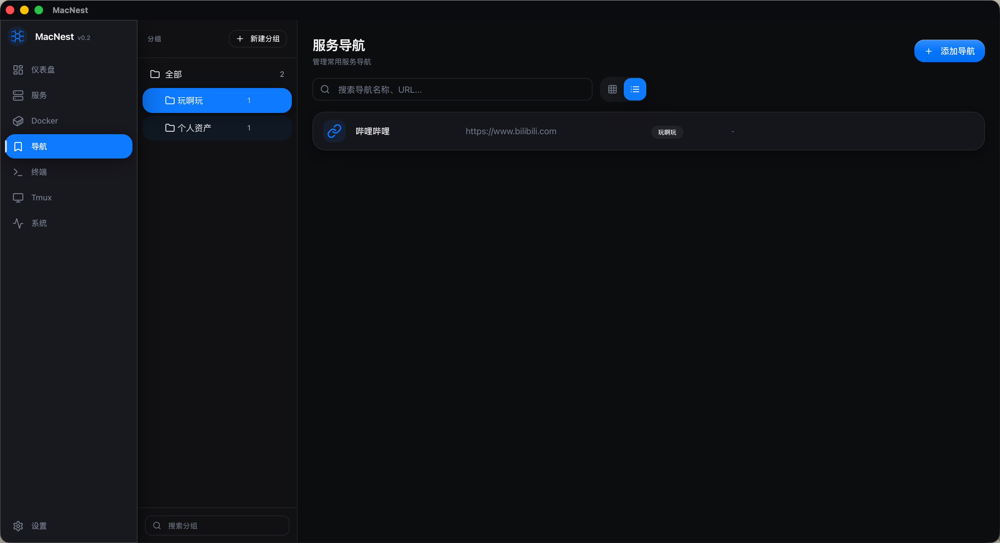
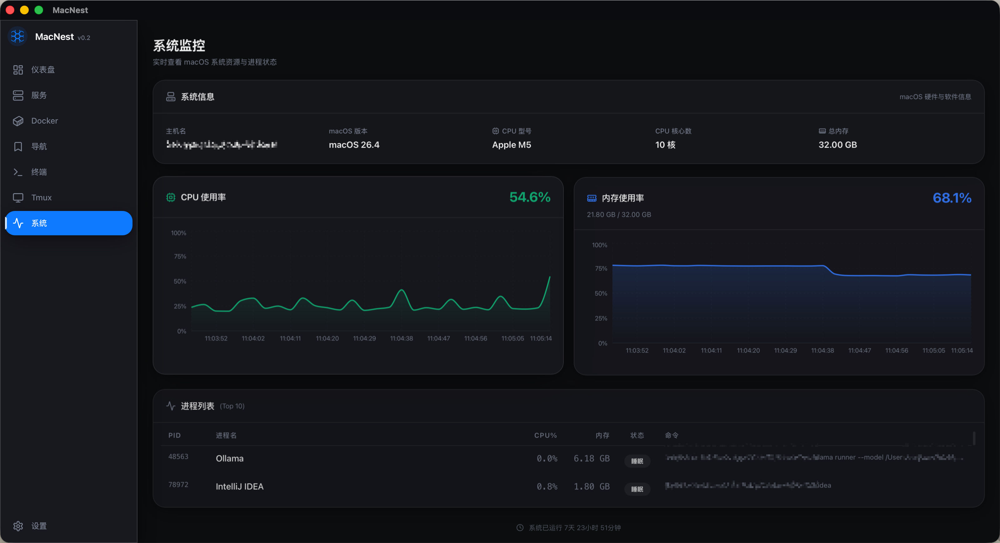

# MacNest

> 面向 macOS 的一站式本地运维面板

MacNest 是一款基于 **Tauri v2 + Rust + React** 构建的 macOS 桌面应用，整合了服务管理、Docker 容器管理、SSH 终端、Tmux 会话、服务导航书签和系统监控，为开发者和运维人员提供统一的本地运维入口。

## 功能概览

| 模块 | 核心功能 |
|------|---------|
| **仪表盘** | 全局运行状态概览、服务状态卡片（一键启停/重启）、快速访问书签、实时资源统计 |
| **服务管理** | 本地进程托管（配置启动命令、工作目录、环境变量），自动端口检测（`lsof`），重启策略（始终/失败/不重启），应用重启后自动恢复运行中的服务 |
| **Docker 管理** | 容器启停/重启/删除/重建（保留数据卷），实时资源监控，内置终端进入容器 |
| **SSH 终端** | 连接管理（密码/密钥认证），树形分组，内置 XTerm.js 终端，集成分栏式 SFTP 文件管理（上传/下载/删除/重命名），传输进度显示 |
| **Tmux 会话** | 创建/删除/重命名会话，内置 PTY 终端 attach，支持在 [Ghostty](https://ghostty.org/) 中打开，生成配置文件 |
| **服务导航** | 常用 URL 书签管理，树形分组，网格/列表视图，25 种图标可选，点击统计，可选关联本地服务 |
| **系统监控** | 实时 CPU/内存使用率图表（Recharts），Top 10 进程列表，系统信息展示 |
| **设置** | 深色/浅色主题，自动刷新间隔，菜单栏图标常驻，配置导出/导入（JSON），数据重置 |

## 截图

| 仪表盘 | 服务管理 |
|--------|----------|
|  |  |

| Docker 管理 | SSH 终端 |
|-------------|----------|
|  |  |

| Tmux 会话 | 服务导航 |
|-----------|----------|
|  |  |

| 系统监控 |
|----------|
|  |

## 技术栈

### 后端（Rust）

| 组件 | 用途 |
|------|------|
| [Tauri v2](https://v2.tauri.app/) | 桌面应用框架，Rust + Web 混合架构 |
| [rusqlite](https://github.com/rusqlite/rusqlite) + [r2d2](https://github.com/sfackler/r2d2) | SQLite 数据库连接池 |
| [tokio](https://tokio.rs/) | 异步运行时 |
| [ssh2](https://github.com/alexcrichton/ssh2-rs) | SSH 客户端与 SFTP 文件传输 |
| [russh](https://github.com/Eugeny/russh) | SSH 协议实现 |
| [portable-pty](https://github.com/wez/wezterm/tree/main/pty) | PTY 伪终端（Tmux 内嵌终端） |
| [tokio-tungstenite](https://github.com/snapview/tokio-tungstenite) | WebSocket 服务器（终端数据流） |
| [aes-gcm](https://github.com/RustCrypto/AEADs) | AES 加密存储 SSH 认证信息 |

### 前端（React + TypeScript）

| 组件 | 用途 |
|------|------|
| [React 19](https://react.dev/) | UI 框架 |
| [React Router v7](https://reactrouter.com/) | 前端路由 |
| [Tailwind CSS v3](https://tailwindcss.com/) + [shadcn/ui](https://ui.shadcn.com/) | 样式与 UI 组件库 |
| [XTerm.js](https://xtermjs.org/) | 终端模拟器 |
| [Recharts](https://recharts.org/) | 数据可视化图表 |
| [Zustand](https://github.com/pmndrs/zustand) | 状态管理 |
| [Lucide React](https://lucide.dev/) | 图标库 |

## 环境要求

- **macOS** 11.0 或更高版本
- **Node.js** 18+ 和 npm（或 pnpm/yarn）
- **Rust** 1.77+（通过 [rustup](https://rustup.rs/) 安装）
- **Docker Desktop**（可选，用于 Docker 管理功能）

## 快速开始

### 1. 克隆项目

```bash
git clone https://github.com/baiyuyao-dev/macnest.git
cd macnest
```

### 2. 安装前端依赖

```bash
npm install
```

### 3. 开发模式运行

```bash
npm run tauri dev
```

这会同时启动前端 Vite 开发服务器和 Tauri 桌面应用。

### 4. 构建发行版

```bash
npm run tauri build
```

构建完成后，`.dmg` 安装包位于 `src-tauri/target/release/bundle/dmg/` 目录。

## 使用说明

### 添加本地服务（如 frpc）

1. 点击左侧菜单「服务」
2. 点击右上角「添加服务」
3. 填写表单：
   - 名称：`内网穿透-frpc`
   - 命令：`/usr/local/bin/frpc -c /Users/你的用户名/.frp/frpc.toml`
   - 工作目录：`/Users/你的用户名`
   - 重启策略：失败时重启
   - 勾选「自动启动」和「自动检测端口」
4. 点击保存，服务将自动启动

### 添加 SSH 连接

1. 点击左侧菜单「终端」
2. 在左侧面板点击「添加连接」
3. 填写主机地址、端口、用户名、密码或私钥路径
4. 支持树形分组管理多个连接
5. 双击连接即可在右侧终端中打开
6. 点击「SFTP」按钮进入文件管理界面

### 添加服务导航书签

1. 点击左侧菜单「导航」
2. 点击「添加书签」
3. 填写名称、URL（如 `http://localhost:8080`）、选择分组和图标
4. 在仪表盘可快速访问，支持关联本地服务

### 菜单栏常驻

在「设置」页面开启「显示菜单栏图标」，MacNest 会常驻在 macOS 菜单栏，点击图标可快速查看服务状态。

## 项目结构

```
macnest/
├── src/                          # 前端源码
│   ├── pages/                    # 页面组件
│   │   ├── Dashboard.tsx         # 仪表盘
│   │   ├── Services.tsx          # 服务管理
│   │   ├── Docker.tsx            # Docker 管理
│   │   ├── Bookmarks.tsx         # 服务导航
│   │   ├── Terminal.tsx          # SSH 终端 + SFTP
│   │   ├── Tmux.tsx              # Tmux 会话管理
│   │   ├── System.tsx            # 系统监控
│   │   └── Settings.tsx          # 设置
│   ├── components/               # 共享组件
│   ├── lib/                      # API 封装与工具函数
│   ├── stores/                   # Zustand 状态管理
│   └── types/                    # TypeScript 类型定义
├── src-tauri/                    # Rust 后端
│   ├── src/
│   │   ├── main.rs               # 应用入口 + 托盘菜单
│   │   ├── commands.rs           # Tauri IPC 命令
│   │   ├── database.rs           # SQLite 数据库层
│   │   ├── process.rs            # 本地进程管理器
│   │   ├── docker.rs             # Docker CLI 封装
│   │   ├── docker_terminal.rs    # Docker 容器内终端
│   │   ├── system.rs             # 系统信息采集
│   │   ├── security.rs           # 加密/解密（凭据保护）
│   │   ├── ssh/                  # SSH 连接、SFTP、会话管理
│   │   └── tmux/                 # Tmux 会话与 PTY 管理
│   ├── Cargo.toml                # Rust 依赖
│   └── tauri.conf.json           # Tauri 配置
├── package.json                  # npm 配置
├── tailwind.config.js            # Tailwind 配置
└── vite.config.ts                # Vite 配置
```

## 核心架构

```
┌──────────────────────────────────────────────────────────┐
│                  React 19 Frontend                        │
│  Dashboard | Services | Docker | Terminal | Tmux | ...   │
├──────────────────────────────────────────────────────────┤
│              Tauri IPC (invoke / listen)                 │
├──────────────────────────────────────────────────────────┤
│                    Rust Backend                          │
│  ┌─────────┐ ┌────────┐ ┌─────────┐ ┌──────────────┐   │
│  │ Process │ │ Docker │ │  SSH    │ │    Tmux      │   │
│  │ Manager │ │  CLI   │ │ Client  │ │   PTY/WS     │   │
│  │(spawn)  │ │(shell) │ │(russh)  │ │(portable-pty)│   │
│  └─────────┘ └────────┘ └─────────┘ └──────────────┘   │
│  ┌─────────┐ ┌────────┐ ┌──────────────────────────┐   │
│  │  SFTP   │ │ System │ │         SQLite           │   │
│  │(ssh2)   │ │Monitor │ │   services/bookmarks/    │   │
│  │         │ │(sysinfo)│ │   ssh/settings/groups    │   │
│  └─────────┘ └────────┘ └──────────────────────────┘   │
├──────────────────────────────────────────────────────────┤
│                    macOS System                          │
│  ┌─────────┐ ┌────────┐ ┌──────────────┐               │
│  │  frpc   │ │ Python │ │ Docker Engine│               │
│  │ Process │ │ Process│ │   (Desktop)  │               │
│  └─────────┘ └────────┘ └──────────────┘               │
└──────────────────────────────────────────────────────────┘
```

## 数据库 Schema（SQLite）

| 表名 | 说明 |
|------|------|
| `services` | 本地服务配置与状态 |
| `bookmarks` | 服务导航书签 |
| `groups` | 树形分组（书签 + SSH 连接共用） |
| `ssh_connections` | SSH 连接配置（认证信息加密存储） |
| `service_logs` | 服务日志记录 |
| `settings` | 应用设置 |
| `docker_cache` | Docker 容器缓存 |
| `resource_snapshots` | 资源使用历史快照 |

## 安全说明

- **SSH 认证信息**（密码、私钥）使用 **AES-256-GCM** 加密后存储在本地 SQLite 数据库中，加密密钥派生自设备唯一标识
- 所有网络操作（SSH、SFTP）仅在本地执行，不经过任何远程服务器
- 进程管理使用标准 `std::process::Command`，无提权操作

## 常见问题

### Q: 构建时提示缺少图标文件？

构建前需要在 `src-tauri/icons/` 目录下放置图标文件。可使用 Tauri CLI 自动生成：

```bash
cargo tauri icon /path/to/your/icon.png
```

### Q: Docker 管理功能无法使用？

确保 Docker Desktop 已安装并运行，且当前用户在 `docker` 用户组中：

```bash
sudo dseditgroup -o edit -a $(whoami) -t user docker
```

### Q: Tmux 功能不可用？

确保已安装 [Tmux](https://github.com/tmux/tmux)：`brew install tmux`

### Q: Ghostty 打开功能不可用？

确保已安装 [Ghostty](https://ghostty.org/) 终端：`brew install --cask ghostty`

### Q: 如何重置所有数据？

在「设置」页面点击「重置所有数据」，所有配置和服务记录将被清除。

## 贡献

欢迎提交 Issue 和 Pull Request！

1. Fork 本仓库
2. 创建功能分支：`git checkout -b feature/xxx`
3. 提交更改：`git commit -am 'Add xxx'`
4. 推送分支：`git push origin feature/xxx`
5. 创建 Pull Request

## 许可证

[MIT](LICENSE)

---

<p align="center">Built with ❤️ using <a href="https://v2.tauri.app/">Tauri</a> + <a href="https://react.dev/">React</a></p>
